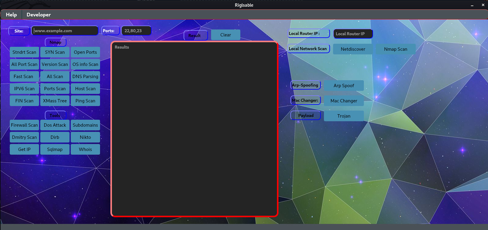
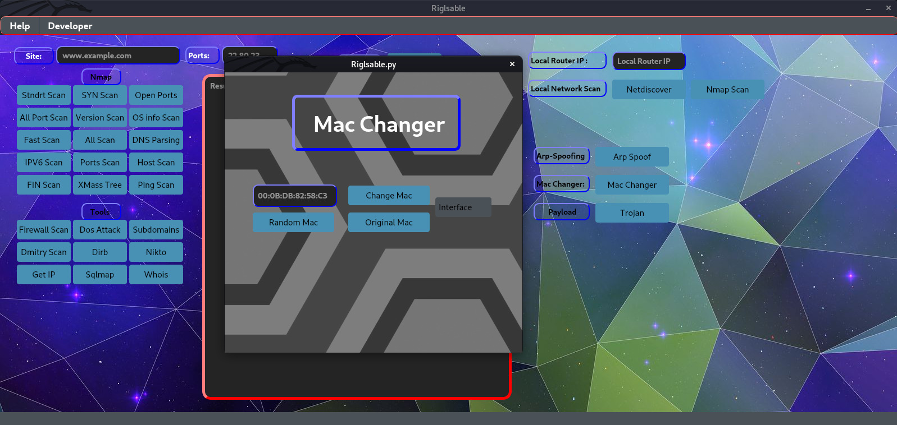
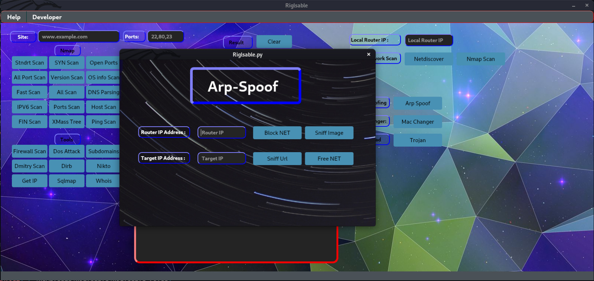

<br />
<p align="center">
  <a href="https://github.com/Brktrlw/Riglsable">
    
  </a>

  <h3 align="center">Riglsable v1.4 beta</h3>

  <p align="center">
    Riglsable Cyber Offensive Tool
    <br />
    <br />
    <p align="center"><address>
      <div align="center">
    <a href="mailto:brktrl@protonmail.ch">Report Bug</a>
    <br>
    <a href="https://riglsable.wixsite.com/riglsable" target="_blank">Web Site</a>
    </div>
    </address>
    </p>
  </p>
</p>


<details open="open">
  <summary><h2 style="display: inline-block">Table of Contents</h2></summary>
  <ol>
    <li>
      <a href="#about-the-project">About The Project</a>
      <ul>
        <li><a href="#built-with">Built With</a></li>
      </ul>
    </li>
    <li>
      <a href="#getting-started">Getting Started</a>
      <ul>
        <li><a href="#installation">Installation</a></li>
      </ul>
    </li>
    <li><a href="#usage">Usage</a></li>
    <li><a href="#OS">Supported Operating System</a>
    <li><a href="Images">Example Images</a>
    <li><a href="#license">License</a></li>
    <li><a href="#contact">Contact</a></li>
  </ol>
</details>


## About The Project


**It is a graphical interface tool that facilitates the use of many tools such as nmap, nikto, dirb.**<br>
**Update 1.6 is coming soon keep waiting...**

`BrktrLawliet`,
`brktrl@protonmail.ch`
`Riglsable`


### Built With

* [PyQt5](https://pypi.org/project/PyQt5/)
* [Python3](https://www.python.org)


## Getting Started

To get a local copy up and running follow these simple steps.
Requirements:
* [Python](https://www.python.org)


### Installation

This is an example of how to list things you need to use the software and how to install them.

1. Clone the repo
   ```sh
   sudo git clone https://github.com/Brktrlw/Riglsable
   ```
2. First use this commands
   ```sh
   apt-get update
   ```
   ```sh
   apt-get upgrade
   ```
3. Login to installed folder
   ```sh
   cd Riglsable
   ```
4. Login to files folder
   ```sh
   cd Riglsable_Files
   ```
5. Install setup.py packages
   ```sh
   sudo python3 setup.py
   ```


## Usage

After making the necessary installations, you need to use the following commands to start the application.

* Open with python3 Riglsable.
   ```sh
   sudo python3 Riglsable.py
   ```
* If it fails try this command.
   ```sh
   sudo python Riglsable.py
   ```

## OS
* Linux

## Images
Sample images about the application.
</img><br>
</img><br>
</img><br>
## License

Distributed under the MIT License. See `LICENSE` for more information.<br>
Copyright (c) 2021 

## Contact

Berkay Şen - [Instagram](https://www.instagram.com/brktrll.z/) - @Brktrll.z <br>
E-Mail Address:E-Mail - brktrl@protonmail.ch

Project Link: [https://github.com/Brktrlw/Riglsable](https://github.com/Brktrlw/Riglsable)
Web Site Link: [https://riglsable.wixsite.com/riglsable](https://riglsable.wixsite.com/riglsable)


